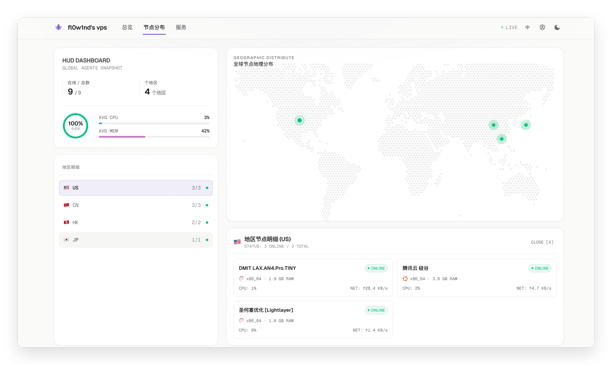

<div align="center">

# 🪷 Lotus

**哪吒监控主题** · 跟随系统 · 玻璃质感 · 克制色彩

为 [哪吒监控](https://github.com/nezhahq/nezha) **v2**（兼容 v1.x）打造的用户前端主题

[](https://github.com/fl0w1nd/Lotus/actions/workflows/ci.yml)
[](https://github.com/fl0w1nd/Lotus/releases)
[](https://react.dev)
[](https://www.typescriptlang.org)
[](https://tailwindcss.com)
[](https://vitejs.dev)

</div>

> 名字取自哪吒的莲花化身 —— 莲（Lotus）。

设计语言取法 Vercel / Linear / Apple：跟随系统深浅色、玻璃质感卡片、等宽数字排版、克制的色彩——让色彩只承载信息（在线 / 告警 / 离线），其余交给灰阶与留白。




<details>
<summary>📷 更多预览（暗色 / 详情页 / 服务页）</summary>


</details>

---

## ✨ 特性

- **节点分布页** — 独立导航标签，左侧 HUD 面板（在线率环形图、地区统计、平均 CPU / 内存条）+ 右侧 Stripe 风格点阵世界地图（构建期生成，运行时零依赖），点击国家展开服务器详情卡片
- **实时总览** — WebSocket 实时流（`/api/v1/ws/server`），聚合统计条（在线数 / 地区 / 实时网速 / 总流量）带数字滚动动画
- **服务器卡片 / 列表** — 卡片与列表双视图，一键切换（持久化偏好）；卡片模式展示 OS 发行版图标（simple-icons）、CPU / 内存 / 磁盘渐变进度（75% 变琥珀、90% 变红）、实时网速 + 流量、迷你网速曲线图；列表模式紧凑五行布局
- **分组 / 搜索 / 排序** — 服务器分组过滤、模糊搜索、按 CPU / 内存 / 流量 / 在线时长排序
- **服务器详情** — 主机信息芯片（含虚拟化类型）、实时指标瓦片、GPU 利用率（多卡）、温度传感器条、负载相对核心数着色、CPU + 内存 / 网络实时曲线、TCP / TCPing 网络监控多线图（可逐线开关 + Peak Cut 峰值裁剪）
- **TSDB 历史指标** — v2 新增 `/api/v1/server/{id}/metrics`，支持 CPU / 内存 / 磁盘 / 上下行 / 负载 / 进程 / 连接 8 种指标，24h / 7d / 30d 切换；`tsdb_enabled: false` 时自动隐藏
- **服务页** — 30 天可用性方块图（Vercel status 风格）+ 周期流量统计进度
- **账单与套餐** — 解析 `public_note` 中的计费数据（与 nezha-dash 约定兼容），六级到期色阶指示（已到期 / ≤3 天脉冲红 → ≤30 天灰阶）、流量用量进度条、套餐标签（带宽 / 流量 / IPv4 / IPv6 / 线路）
- **自定义代码注入** — 管理后台「自定义代码」中的 CSS / JS 会被注入页面，所有官方变量可用
- **健康感知 favicon** — 浏览器标签图标随整体健康状态变色（正常紫 / 有离线琥珀 / 大面积故障红）
- **断线提示** — WebSocket 断开超 3 秒显示顶部重连提示条
- **暗 / 亮主题** — 默认跟随系统，可手动切换（系统 → 浅色 → 深色三态循环），支持 `window.ForceTheme` 强制；`theme-color` 与 `<html lang>` 动态同步
- **中 / 英双语** — 跟随浏览器语言与面板 `language` 配置，可手动切换
- **可访问性** — 全局键盘焦点环、WCAG 对比度校准、移动端完整适配、入场动画尊重 `prefers-reduced-motion`

---

## 🚀 快速部署

### 1. 下载主题包

前往 [Releases](https://github.com/fl0w1nd/Lotus/releases) 页面，下载最新版本的 `dist.zip`：

```bash
# 示例：下载并解压到当前目录
wget https://github.com/fl0w1nd/Lotus/releases/latest/download/dist.zip
unzip dist.zip
# 解压后得到 nezha-theme-lotus-dist/ 目录
```

### 2. Docker 挂载部署（推荐）

Nezha Dashboard 在服务前端文件时优先读取本地文件系统（`os.OpenRoot`），回退到二进制内嵌资源。因此只需将主题目录挂载到容器内的 `user-dist` 路径即可覆盖官方主题：

```yaml
# docker-compose.yml
services:
  dashboard:
    image: ghcr.io/nezhahq/nezha:latest
    volumes:
      - ./data:/dashboard/data
      - ./nezha-theme-lotus-dist:/dashboard/user-dist:ro   # ← 挂载主题
    ports:
      - 8008:8008
```

启动容器：

```bash
docker compose up -d
```

> **💡 提示**：更新主题时只需下载新版 `dist.zip` 解压覆盖 `nezha-theme-lotus-dist/` 目录，然后重启容器即可。

### 3. 二进制部署挂载

若使用一键脚本安装的独立二进制（非 Docker），同样利用本地文件优先机制——将主题放到 Dashboard 工作目录下的 `user-dist/`：

```bash
# 默认安装路径为 /opt/nezha/dashboard/
unzip dist.zip
sudo cp -r nezha-theme-lotus-dist /opt/nezha/dashboard/user-dist

# 重启服务
sudo systemctl restart nezha-dashboard
```

### 4. ⚠️ 前置反向代理（必需）

Nezha Dashboard 后端存在 [304 状态码覆写 bug](https://github.com/nezhahq/nezha/issues)：`GinCustomWriter` 将 HTTP `304 Not Modified` 强制覆写为 `200`，但 body 已被剥离，浏览器收到空响应后白屏。**必须在前置反代中剥离条件请求头，绕过此 bug。**

**Nginx（推荐）：**

```nginx
server {
  listen 443 ssl;
  server_name status.example.com;

  location / {
    proxy_pass http://127.0.0.1:8008;
    proxy_set_header Host $host;
    proxy_set_header Upgrade $http_upgrade;
    proxy_set_header Connection "upgrade";
    proxy_http_version 1.1;

    # 必备：剥离条件请求头，绕过 Nezha 后端的 304→200 bug
    proxy_set_header If-Modified-Since "";
    proxy_set_header If-None-Match "";
  }
}
```

**Caddy：**

```caddyfile
status.example.com {
    reverse_proxy {
        to localhost:8008

        # 必备：剥离条件请求头，绕过 Nezha 后端的 304→200 bug
        header_down If-Modified-Since ""
        header_down If-None-Match ""
    }
}
```

### 其他部署方式

<details>
<summary>📦 方式二：独立托管 + 反向代理</summary>

将 `dist/` 部署到任意静态服务（nginx / Caddy / CDN），将 `/api/v1/` 反代到面板并保留 WebSocket 升级头。本主题使用 Hash 路由，不需要 SPA fallback：

```nginx
server {
  listen 443 ssl;
  server_name status.example.com;

  root /var/www/lotus-dist;

  location /api/v1/ {
    proxy_pass http://dashboard:8008;
    proxy_http_version 1.1;
    proxy_set_header Upgrade $http_upgrade;
    proxy_set_header Connection "upgrade";
    proxy_set_header Host $host;

    # 必备：剥离条件请求头，绕过 Nezha 后端的 304→200 bug
    proxy_set_header If-Modified-Since "";
    proxy_set_header If-None-Match "";
  }
}
```

</details>

<details>
<summary>🐳 方式三：支持运行时主题加载的社区镜像</summary>

部分社区维护的 Dashboard 镜像支持通过环境变量从 GitHub Release 拉取主题（`NZ_EXTRA_USER_THEME_REPOSITORY` / `NZ_EXTRA_USER_THEME_VERSION` 等）。本仓库 CI 在打 tag 时会自动构建并把 `dist.zip` 附加到 Release，可直接配合使用。

</details>

---

## ⚙️ 自定义变量

与官方主题保持兼容，在管理后台「自定义代码」中设置：

| 变量 | 说明 |
| --- | --- |
| `window.ForceTheme` | `"light"` / `"dark"` 强制颜色主题 |
| `window.CustomLogo` | 替换左上角 Logo 图片 URL |
| `window.CustomDesc` | 站名旁的描述文本 |
| `window.CustomLinks` | 自定义外链，JSON 字符串，如 `'[{"name":"Blog","link":"https://example.com"}]'` |
| `window.CustomBackgroundImage` | 桌面端背景图 URL |
| `window.CustomMobileBackgroundImage` | 移动端背景图 URL |
| `window.ShowNetTransfer` | 是否在卡片显示累计流量（本主题默认显示，设为 `false` 可隐藏） |
| `window.ForceUseSvgFlag` | 强制使用 SVG 国旗（Windows 平台会自动启用，emoji 国旗在 Windows 不可用） |

---

## 🛠 开发

```bash
pnpm install
pnpm mock   # 终端 1：启动本地 mock 哪吒 v2 后端（REST + WS，端口 8008）
pnpm dev    # 终端 2：启动 Vite 开发服务器
```

本地 mock 默认管理员态，可直接测试网络监控 7 天 / 30 天；游客态用
`MOCK_AUTH=guest pnpm mock`。

对接真实面板调试（代理转发 API 与 WebSocket）：

```bash
NEZHA_BACKEND=https://your-dashboard.example.com pnpm dev
```

构建：

```bash
pnpm build   # 产物在 dist/
```

---

## 🧩 技术栈

React 19 · TypeScript · Vite 8 · Tailwind CSS 4 · TanStack Query · Recharts · react-router · NumberFlow · simple-icons · Geist 字体

> 世界地图点阵数据由 `pnpm gen:map` 在构建期生成（基于 dotted-map），运行时为纯 SVG，零依赖。

## 📡 数据接口

| 接口 | 用途 |
| --- | --- |
| `WS /api/v1/ws/server` | 实时状态流 |
| `GET /api/v1/server-group` | 服务器分组 |
| `GET /api/v1/service` | 服务可用性 + 周期流量 |
| `GET /api/v1/server/{id}/service` | 单机 ping 监控 |
| `GET /api/v1/server/{id}/metrics` | TSDB 历史指标（v2） |
| `GET /api/v1/setting` | 站点配置 / 版本 / tsdb 开关 |

---

## 📄 开源协议

本项目基于 [MIT License](LICENSE) 开源。

```
MIT License

Copyright (c) 2026 fl0w1nd

Permission is hereby granted, free of charge, to any person obtaining a copy
of this software and associated documentation files (the "Software"), to deal
in the Software without restriction, including without limitation the rights
to use, copy, modify, merge, publish, distribute, sublicense, and/or sell
copies of the Software, and to permit persons to whom the Software is
furnished to do so, subject to the following conditions:

The above copyright notice and this permission notice shall be included in all
copies or substantial portions of the Software.

THE SOFTWARE IS PROVIDED "AS IS", WITHOUT WARRANTY OF ANY KIND, EXPRESS OR
IMPLIED, INCLUDING BUT NOT LIMITED TO THE WARRANTIES OF MERCHANTABILITY,
FITNESS FOR A PARTICULAR PURPOSE AND NONINFRINGEMENT. IN NO EVENT SHALL THE
AUTHORS OR COPYRIGHT HOLDERS BE LIABLE FOR ANY CLAIM, DAMAGES OR OTHER
LIABILITY, WHETHER IN AN ACTION OF CONTRACT, TORT OR OTHERWISE, ARISING FROM,
OUT OF OR IN CONNECTION WITH THE SOFTWARE OR THE USE OR OTHER DEALINGS IN THE
SOFTWARE.
```

---

## 🤝 友情链接

- [**Linux.do**](https://linux.do) — 真诚、友善、团结、专业，共建你我引以为荣之社区。
