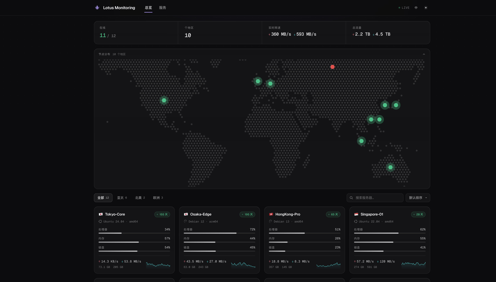
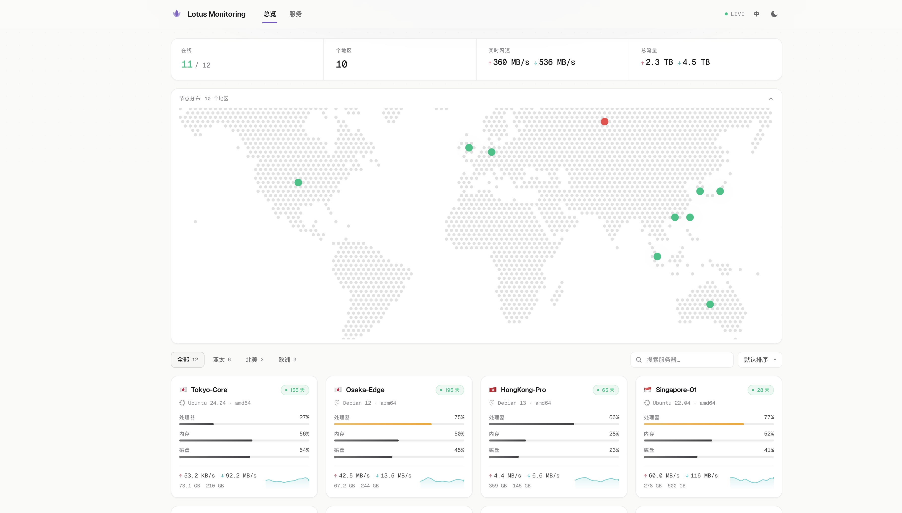
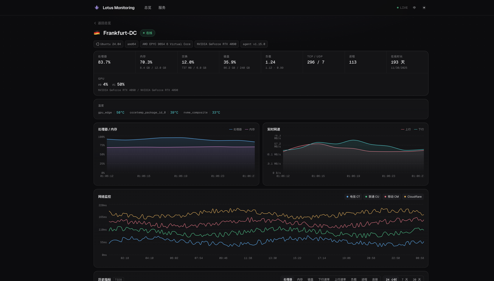
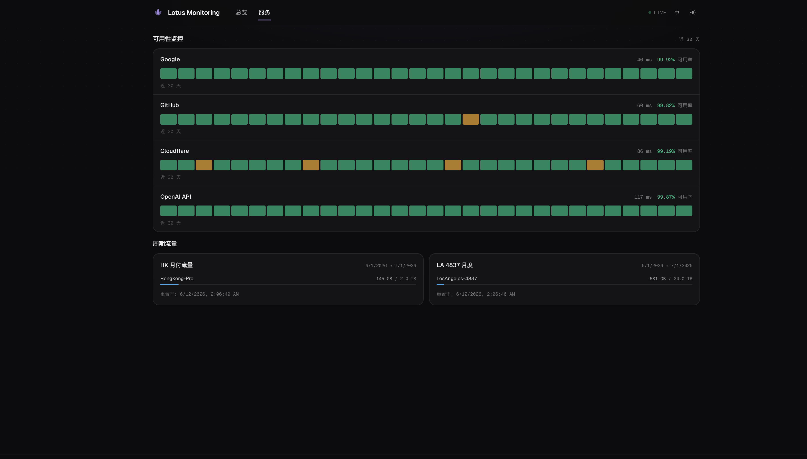

# Lotus · 哪吒监控主题

一个为 [哪吒监控](https://github.com/nezhahq/nezha) **v2**(兼容 v1.x)打造的用户前端主题。
设计语言取法 Vercel / Linear / Apple:深色优先、玻璃质感卡片、等宽数字排版、克制的色彩——让色彩只承载信息(在线/告警/离线),其余交给灰阶与留白。

> 名字取自哪吒的莲花化身 —— 莲(Lotus)。



<details>
<summary>更多预览(亮色 / 详情页 / 服务页)</summary>





</details>

## 特性

- **世界点阵地图** — Stripe 风格的点阵世界地图(构建期生成,运行时零依赖),服务器按国家聚合为脉冲光点(在线绿 / 离线红),可折叠,支持 `window.ForceShowMap`
- **实时总览** — WebSocket 实时流(`/api/v1/ws/server`),聚合统计条(在线数 / 地区 / 实时网速 / 总流量)带数字滚动动画
- **服务器卡片** — OS 发行版图标(simple-icons)、CPU / 内存 / 磁盘渐变进度(75% 变琥珀、90% 变红),实时网速 + 流量,卡片内置网速迷你曲线图(由 WS 流即时累积)
- **分组 / 搜索 / 排序** — 服务器分组过滤、模糊搜索、按 CPU / 内存 / 流量 / 在线时长排序
- **服务器详情** — 主机信息芯片(含虚拟化类型)、实时指标瓦片、GPU 利用率(多卡)、温度传感器条(按温度着色)、负载相对核心数着色、CPU+内存 / 网络实时曲线、TCP/TCPing 网络监控多线图(可逐线开关)
- **TSDB 历史指标** — v2 新增的 `/api/v1/server/{id}/metrics` 历史数据,支持 CPU / 内存 / 磁盘 / 上下行 / 负载 / 进程 / 连接 8 种指标,24h / 7d / 30d 切换;`tsdb_enabled: false` 时自动隐藏
- **服务页** — 30 天可用性方块图(Vercel status 风格)+ 周期流量统计进度
- **账单与套餐** — 解析 `public_note` 中的计费数据(与 nezha-dash 约定兼容),展示到期倒计时、价格、带宽、线路等
- **自定义代码注入** — 管理后台「自定义代码」中的 CSS / JS 会被注入页面,所有官方变量可用
- **健康感知 favicon** — 浏览器标签图标随整体健康状态变色(正常紫 / 有离线琥珀 / 大面积故障红)
- **断线提示** — WebSocket 断开超 3 秒显示顶部重连提示条
- **暗 / 亮主题** — 跟随系统,可手动切换,支持 `window.ForceTheme` 强制;`theme-color` 与 `<html lang>` 动态同步
- **中 / 英双语** — 跟随浏览器语言与面板 `language` 配置,可手动切换
- **可访问性** — 全局键盘焦点环、WCAG 对比度校准、移动端完整适配、入场动画尊重 `prefers-reduced-motion`

## 支持的自定义代码变量

与官方主题保持兼容,在管理后台「自定义代码」中设置:

| 变量 | 说明 |
| --- | --- |
| `window.ForceTheme` | `"light"` / `"dark"` 强制颜色主题 |
| `window.CustomLogo` | 替换左上角 Logo 图片 URL |
| `window.CustomDesc` | 站名旁的描述文本 |
| `window.CustomLinks` | 自定义外链,JSON 字符串,如 `'[{"name":"Blog","link":"https://example.com"}]'` |
| `window.CustomBackgroundImage` | 桌面端背景图 URL |
| `window.CustomMobileBackgroundImage` | 移动端背景图 URL |
| `window.ShowNetTransfer` | 是否在卡片显示累计流量(本主题默认显示,设为 `false` 可隐藏) |
| `window.ForceShowMap` | 强制展开首页节点分布地图 |
| `window.ForceUseSvgFlag` | 强制使用 SVG 国旗(Windows 平台会自动启用,emoji 国旗在 Windows 不可用) |

## 开发

```bash
pnpm install
pnpm mock   # 终端 1:启动本地 mock 哪吒 v2 后端(REST + WS,端口 8008)
pnpm dev    # 终端 2:启动 Vite 开发服务器
```

对接真实面板调试(代理转发 API 与 WebSocket):

```bash
NEZHA_BACKEND=https://your-dashboard.example.com pnpm dev
```

## 构建与部署

```bash
pnpm build   # 产物在 dist/
```

主题是纯静态 SPA,所有请求走相对路径 `/api/v1/*`,与面板同源即可工作。三种部署方式:

### 方式一:挂载替换官方容器的 user-dist(推荐)

官方 Dashboard 容器内的用户前端位于 `/dashboard/user-dist`,直接用构建产物覆盖:

```yaml
# docker-compose.yml
services:
  dashboard:
    image: ghcr.io/nezhahq/nezha:latest
    volumes:
      - ./data:/dashboard/data
      - ./lotus-dist:/dashboard/user-dist:ro   # 构建出的 dist 目录
    ports:
      - 8008:8008
```

### 方式二:独立托管 + 反向代理

把 `dist/` 部署到任意静态服务(nginx / Caddy / CDN),将 `/api/v1/` 反代到面板,并保留 WebSocket 升级头:

```nginx
server {
  listen 443 ssl;
  server_name status.example.com;

  root /var/www/lotus-dist;
  location / {
    try_files $uri /index.html;   # SPA fallback
  }

  location /api/v1/ {
    proxy_pass http://dashboard:8008;
    proxy_http_version 1.1;
    proxy_set_header Upgrade $http_upgrade;
    proxy_set_header Connection "upgrade";
    proxy_set_header Host $host;
  }
}
```

### 方式三:支持运行时主题加载的社区镜像

部分社区维护的 Dashboard 镜像支持通过环境变量从 GitHub Release 拉取主题
(`NZ_EXTRA_USER_THEME_REPOSITORY` / `NZ_EXTRA_USER_THEME_VERSION` 等)。
本仓库的 CI 在打 tag 时会自动构建并把 `dist.zip` 附加到 Release,可直接配合使用。

## 技术栈

React 19 · TypeScript · Vite 8 · Tailwind CSS 4 · TanStack Query · Recharts · simple-icons · Geist 字体

> 世界地图点阵数据由 `pnpm gen:map` 在构建期生成(`scripts/gen-world-dots.mjs`,基于 dotted-map),运行时为纯 SVG,无额外依赖。

## 数据接口

| 接口 | 用途 |
| --- | --- |
| `WS /api/v1/ws/server` | 实时状态流 |
| `GET /api/v1/server-group` | 服务器分组 |
| `GET /api/v1/service` | 服务可用性 + 周期流量 |
| `GET /api/v1/server/{id}/service` | 单机 ping 监控 |
| `GET /api/v1/server/{id}/metrics` | TSDB 历史指标(v2) |
| `GET /api/v1/setting` | 站点配置 / 版本 / tsdb 开关 |
